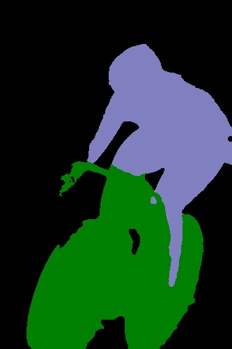

# Deeplab v2 with pytorch
It is an reimplement of [deeplab v2](https://arxiv.org/abs/1606.00915) with pytorch when I learn pytorch.  I get a validation performance of 74.47% IoU(73.10% before DenseCRF) on the PASCAL VOC2012.

## Acknowledge
During finishing this work, I have referenced a lot of gread work, including:
- [isht7/pytorch-deeplab-resnet](https://github.com/isht7/pytorch-deeplab-resnet)
- [DrSleep/tensorflow-deeplab-resnet](https://github.com/DrSleep/tensorflow-deeplab-resnet)
- [jwyang/faster-rcnn.pytorch](https://github.com/jwyang/faster-rcnn.pytorch)

Among them, isht7's work is the main reference source and I learn from his code about how to define the net and compute the mIoU, etc. In fact, his work is very complete except for denseCRF. If you use python 2, I recommend you to his github. My work supports **python 3** and **Pytorch 0.4.0**.
DrSleep's work gives a good example about how to use pydensecrf as well as visulization.

## Installing and Preparing for data/model
step 0: **Download**
```
git clone https://github.com/zhoulukuan/deeplab_v2_pytorch
```
step 1: **Install pytorch 0.4.0 and torchvision**

I only test my work on pytorch 0.4.0 and ubuntu. Follow the step in [pytorch official website](https://pytorch.org/get-started/previous-versions/) according to your CUDA version. GPU is not necessary, but your  will be very slow without GPU.

step 2: **Install Python Package**
```
pip install -r requirement
```
Among them, tensorflow is necessary for tensorboardX. If you don't want to use them for visualization, delete them from the list.

step 3: **Dataset preparation**

We use the PASCAL VOC2012 Dataset. Go to the official website and download. We use the augmented labels as described in the deeplab paper. You can dowoload them from [here](https://pan.baidu.com/s/1OVevwsNl_pda-OTT0lGW_Q). Put them under the data/VOC2012, the final file structure is shown below：
```
data
  |- VOC2012
  	|- SegmentationClassAug #label
  	|- JPEGImages  #images
```

step 4: **Pretrained Model**
1. For better results, pretrained model on COCO for initialization is necessary. I'm not familiar with caffe, so I use the converted model from isht7. You can dowoload it from [here](https://pan.baidu.com/s/1OVevwsNl_pda-OTT0lGW_Q). You can refer isht7/pytorch-deeplab-resnet and learn how to convert model from original caffe model. The default pretrained model path is data/MS_DeepLab_resnet_pretrained_COCO_init.pth
You can change it by changing lib/utils/config.py
3. Download my trained model for demo from [here](https://pan.baidu.com/s/1OVevwsNl_pda-OTT0lGW_Q). Converted model training by caffe(MS_DeepLab_resnet_trained_VOC.pth)could also be found. You can use it for test single image or reproduce XX.XX mIoU on PASCAL VOC 2012 val set.

## Usage
### Demo
Test on a single image could be done bu running
```
python demo.py --img_path path/to/your/img --model path/to/my/trained/model
```
You can get a similar image as follow:



Result image could be saved as **result.jpg**.
Be careful, if you use MS_DeepLab_resnet_trained_VOC.pth. You can load model by:
```
checkpoint = torch.load(model_path)
net.load_state_dict(checkpoint)
```
However, if you use trained model from this project, please use:
```
checkpoint = torch.load(model_path)
net.load_state_dict(checkpoint['model'])
```
Because I save extra variable such as learning rate and iters for resuming. The evaluation code in `test.py` is used in the same way.

### Train
Training your own model could be done by running:
```
python trainval.py
```
Change command line arguments if necessary. You can read `def parse_args()` in `trainval.py` to learn about them. Hyperparametres such as learning rate can be set by changing `cfgs/res101.yml`. You can find most of the commonly used hyperparameters in this file. There are some  other hyperparameters in the `utils/config.py`, but most of the time you don't need to change them.

### Test
Testing your trained model could be done by running:
```
python test.py --model=path/to/your/model
```
You can see the final result on PASCAL VOC2012 after a while. If you want to use denseCRF, change TEST.IF_CRF in `config.py`. However, it may cost you about 40-50 min because denseCRF is time-consuming.

### TensorboardX
Monitor your training process with tensorboardX. Run:
```
tensorboard --logdir=$DEEPLAB_V2_PYTORCH/logs/loss_lr/lr --port=7001
```
Then open your firefox or chrome, and visit localhost:7001. 

## Result
This work including many tricks in paper, including: multi-scale inputs, models pretrained on MS-COCO for initization, data augmentation and ASPP-L. However, I only achieve 74.47% mIoU(73.31% before denseCRF, with 2e-5 learning rate and 40000 iters). And caffe model converted by isht7 can achieve 75.54% before DenseCRF. Best result in paper is 77.69% with denseCRF. How to achieve such a good performance is left as a future work.

## Todo
[x] DenseCRF

[ ] Reproduce the results in paper(75.54%)

[ ] Support Pytorch 0.4.1+